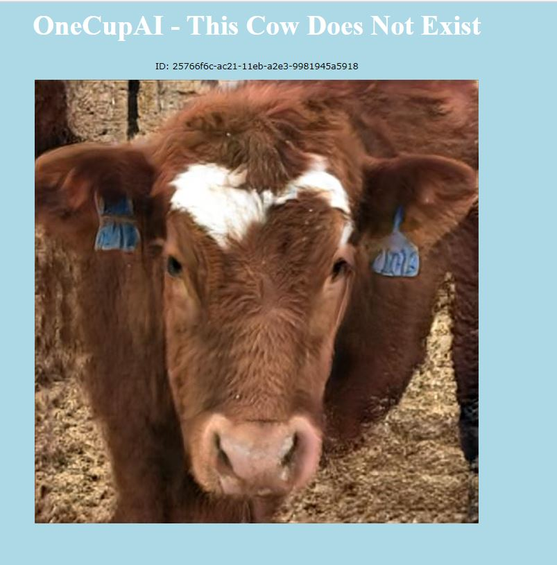

# Cow_SytleGAN2
This project builds web application which are able to generate realistic fake cow faces by using the StyleGAN2-ADA framework credit by Nvidia

# Before running it:
1. install libraries required for StyleGAN2 - ADA 

    pip install click requests tqdm pyspng ninja imageio-ffmpeg==0.4.3
    
2. install flask:

    pip install flask

# Run the application

   python  webapp_cow.py  --model <model_path>   (defult model path is 'output/')

# Website "This Cow Does Not Exist"
http://3.237.9.245:5000/

Example result:

